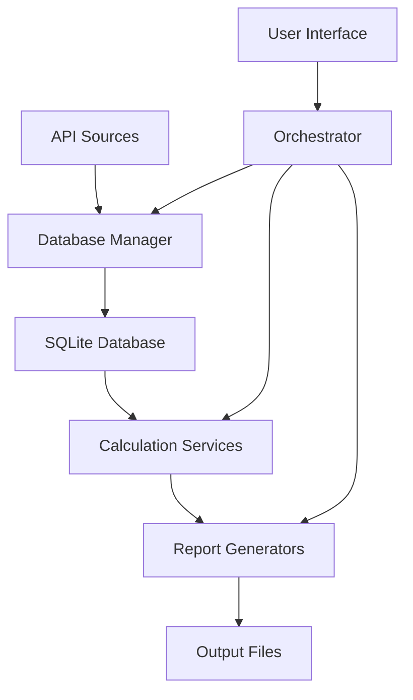
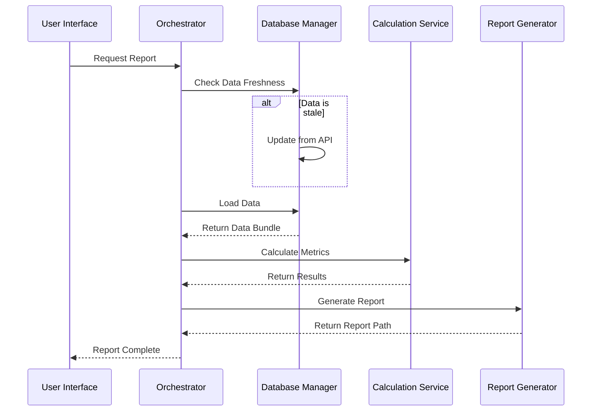

# 🏗️ Application Architecture

## Overview

The Eclesiar application follows **Clean Architecture** principles with clear separation of concerns and multiple design patterns. This document provides a comprehensive guide to the architecture, design patterns, and development principles used throughout the application.

## 📐 Architectural Principles

### Clean Architecture Layers

```
┌─────────────────────────────────────────────────────────────┐
│                    Presentation Layer                       │
│  ┌─────────────────┐  ┌─────────────────┐  ┌─────────────┐ │
│  │   CLI Interface │  │   Web API       │  │   Reports   │ │
│  │   (main.py)     │  │   (web_api.py)  │  │ (generators)│ │
│  └─────────────────┘  └─────────────────┘  └─────────────┘ │
└─────────────────────────────────────────────────────────────┘
                              │
┌─────────────────────────────────────────────────────────────┐
│                    Application Layer                        │
│  ┌─────────────────┐  ┌─────────────────┐  ┌─────────────┐ │
│  │   Orchestrator  │  │   Services      │  │  Strategies │ │
│  │   Service       │  │   Layer         │  │   Pattern   │ │
│  │  (orchestrator) │  │  (calculations) │  │ (fetching)  │ │
│  └─────────────────┘  └─────────────────┘  └─────────────┘ │
└─────────────────────────────────────────────────────────────┘
                              │
┌─────────────────────────────────────────────────────────────┐
│                      Domain Layer                           │
│  ┌─────────────────┐  ┌─────────────────┐  ┌─────────────┐ │
│  │   Entities      │  │   Repository    │  │   Business  │ │
│  │   (Models)      │  │   Interfaces    │  │   Rules     │ │
│  │  (entities.py)  │  │(repositories.py)│  │ (services)  │ │
│  └─────────────────┘  └─────────────────┘  └─────────────┘ │
└─────────────────────────────────────────────────────────────┘
                              │
┌─────────────────────────────────────────────────────────────┐
│                   Infrastructure Layer                      │
│  ┌─────────────────┐  ┌─────────────────┐  ┌─────────────┐ │
│  │   Database      │  │   API Client    │  │   Storage   │ │
│  │   (SQLite)      │  │   (HTTP)        │  │   (Cache)   │ │
│  │   (models.py)   │  │   (client.py)   │  │  (cache.py) │ │
│  └─────────────────┘  └─────────────────┘  └─────────────┘ │
└─────────────────────────────────────────────────────────────┘
```

### Key Architectural Benefits

1. **Separation of Concerns**: Each layer has a single responsibility
2. **Dependency Inversion**: Higher layers depend on abstractions, not concretions
3. **Testability**: Easy to mock dependencies and test isolated units
4. **Maintainability**: Changes are localized to specific layers
5. **Scalability**: New features can be added without affecting existing code

## 🎯 Design Patterns

### 1. Repository Pattern

**Purpose**: Abstracts data access logic from business logic

**Location**: 
- Interfaces: `src/core/models/repositories.py`
- Implementations: `src/data/repositories/sqlite_repository.py`

**Example**:
```python
# Interface (Domain Layer)
class CountryRepository(ABC):
    @abstractmethod
    def get_all(self) -> List[Country]:
        pass

# Implementation (Infrastructure Layer)
class SQLiteCountryRepository(CountryRepository):
    def get_all(self) -> List[Country]:
        # SQLite-specific implementation
        pass
```

**Benefits**:
- Data source independence
- Easy testing with mock repositories
- Centralized query logic

### 2. Service Layer Pattern

**Purpose**: Encapsulates business logic and coordinates between domain objects

**Location**: `src/core/services/`

**Example**:
```python
class ProductionCalculationService:
    def __init__(self, country_repo: CountryRepository):
        self.country_repo = country_repo
    
    def calculate_efficiency(self, params: ProductionParams) -> ProductionResult:
        # Business logic here
        pass
```

**Benefits**:
- Centralized business rules
- Reusable across different interfaces
- Clear transaction boundaries

### 3. Factory Pattern

**Purpose**: Creates objects without specifying their concrete classes

**Location**: `src/reports/factories/report_factory.py`

**Example**:
```python
class ReportFactory:
    @staticmethod
    def create_generator(report_type: str) -> ReportGenerator:
        if report_type == "daily":
            return DailyReportGenerator()
        elif report_type == "production":
            return ProductionReportGenerator()
        # ...
```

**Benefits**:
- Loose coupling between creation and usage
- Easy to add new report types
- Centralized object creation logic

### 4. Strategy Pattern

**Purpose**: Defines algorithms that can be interchanged at runtime

**Location**: `src/core/strategies/data_fetching_strategy.py`

**Example**:
```python
class DataFetchingContext:
    def __init__(self, strategy: DataFetchingStrategy):
        self.strategy = strategy
    
    def fetch_data(self) -> Dict[str, Any]:
        return self.strategy.fetch()
```

**Benefits**:
- Algorithm flexibility
- Runtime strategy switching
- Easy to add new algorithms

### 5. Dependency Injection

**Purpose**: Provides dependencies to objects rather than having them create dependencies

**Location**: `src/core/config/app_config.py`

**Example**:
```python
class AppConfig:
    def get_production_service(self) -> ProductionCalculationService:
        return ProductionCalculationService(
            country_repo=self.get_country_repository(),
            currency_repo=self.get_currency_repository()
        )
```

**Benefits**:
- Loose coupling
- Easy testing
- Configuration centralization

## 📁 Directory Structure

### Core Business Logic (`src/core/`)

```
src/core/
├── models/                     # Domain Layer
│   ├── entities.py            # Domain entities (Country, Currency, etc.)
│   └── repositories.py        # Repository interfaces
├── services/                   # Application Layer
│   ├── calculations/          # Calculation services
│   │   ├── production_calculation_service.py
│   │   ├── currency_calculation_service.py
│   │   ├── market_calculation_service.py
│   │   └── region_calculation_service.py
│   ├── orchestrator_service.py        # Main orchestrator
│   ├── database_manager_service.py    # Database management
│   └── calculator_service.py          # Interactive calculator
├── strategies/                 # Strategy Pattern
│   └── data_fetching_strategy.py
└── config/                     # Configuration & DI
    └── app_config.py
```

### Data Access (`src/data/`)

```
src/data/
├── api/                        # External API integration
│   └── client.py              # HTTP client
├── database/                   # Database layer
│   └── models.py              # SQLite schema and operations
├── repositories/               # Repository implementations
│   └── sqlite_repository.py   # SQLite repositories
└── storage/                    # Storage management
    └── cache.py               # Caching logic
```

### Reports Generation (`src/reports/`)

```
src/reports/
├── generators/                 # Report generators
│   ├── daily_report.py        # Daily DOCX reports
│   ├── html_report.py         # HTML reports
│   ├── production_report.py   # Production analysis
│   ├── arbitrage_report.py    # Currency arbitrage
│   └── short_economic_report.py
├── factories/                  # Factory Pattern
│   └── report_factory.py      # Report creation factory
├── templates/                  # Report templates
└── exporters/                  # Export formats
    ├── export_markdown.py
    ├── export_plaintext.py
    └── export_rtf.py
```

## 🔄 Data Flow

### Database-First Approach

The application implements a **Database-First** approach for improved performance and reliability:

1. **Data Collection**: API data is fetched and stored in SQLite database
2. **Data Processing**: All calculations use database data (not API cache)
3. **Report Generation**: Reports are generated exclusively from database
4. **Caching**: Database serves as the primary cache layer



### Service Interactions



## 🧪 Testing Strategy

### Unit Testing

- **Target**: Individual services and calculation functions
- **Approach**: Mock all dependencies using repository interfaces
- **Coverage**: Business logic, calculations, data transformations

### Integration Testing

- **Target**: Service interactions and database operations
- **Approach**: Use test database with known data
- **Coverage**: End-to-end workflows, data persistence

### Test Organization

```
tests/
├── unit/                       # Unit tests
│   ├── test_calculation_services.py
│   ├── test_repositories.py
│   └── test_report_generators.py
├── integration/                # Integration tests
│   ├── test_orchestrator.py
│   ├── test_database_manager.py
│   └── test_full_workflow.py
└── fixtures/                   # Test data
    ├── sample_api_responses.json
    └── test_database.db
```

## 🚀 Performance Considerations

### Database Optimization

1. **Indexes**: Strategic indexing on frequently queried columns
2. **WAL Mode**: Write-Ahead Logging for better concurrency
3. **Connection Pooling**: Efficient connection management
4. **Data Retention**: Automatic cleanup of old data

### Calculation Optimization

1. **Service Caching**: Results cached within service instances
2. **Bulk Operations**: Batch processing for large datasets
3. **Parallel Processing**: ThreadPoolExecutor for concurrent operations
4. **Lazy Loading**: Data loaded only when needed

### Memory Management

1. **Generators**: Use generators for large data processing
2. **Context Managers**: Proper resource cleanup
3. **Data Streaming**: Process data in chunks for large files
4. **Object Pooling**: Reuse expensive objects

## 🔧 Configuration Management

### Environment-Based Configuration

```python
# config/settings/base.py
class Config:
    DATABASE_PATH = os.getenv("ECLESIAR_DB_PATH", "data/eclesiar.db")
    API_URL = os.getenv("API_URL", "https://api.eclesiar.com")
    CACHE_TTL_MINUTES = int(os.getenv("CACHE_TTL_MINUTES", "5"))
```

### Dependency Injection Container

```python
# src/core/config/app_config.py
class AppConfig:
    def __init__(self):
        self._repositories = {}
        self._services = {}
    
    def get_country_repository(self) -> CountryRepository:
        if 'country_repo' not in self._repositories:
            self._repositories['country_repo'] = SQLiteCountryRepository(
                self.config.database.path
            )
        return self._repositories['country_repo']
```

## 🛡️ Error Handling

### Exception Hierarchy

```python
class EclesiarException(Exception):
    """Base exception for Eclesiar application"""
    pass

class DatabaseException(EclesiarException):
    """Database-related exceptions"""
    pass

class APIException(EclesiarException):
    """API-related exceptions"""
    pass

class CalculationException(EclesiarException):
    """Calculation-related exceptions"""
    pass
```

### Error Recovery Strategies

1. **Graceful Degradation**: Continue with reduced functionality
2. **Retry Mechanisms**: Automatic retry for transient failures
3. **Fallback Data**: Use cached or default data when primary fails
4. **User Feedback**: Clear error messages and recovery suggestions

## 📚 Development Guidelines

### Adding New Features

1. **Define Domain Entity**: Add to `src/core/models/entities.py`
2. **Create Repository Interface**: Add to `src/core/models/repositories.py`
3. **Implement Repository**: Add to `src/data/repositories/`
4. **Create Service**: Add business logic to `src/core/services/`
5. **Register Dependencies**: Update `src/core/config/app_config.py`
6. **Add Tests**: Create unit and integration tests
7. **Update Documentation**: Document the new feature

### Code Quality Standards

1. **Type Hints**: All functions should have type annotations
2. **Docstrings**: All public methods need documentation
3. **Error Handling**: Proper exception handling and logging
4. **Testing**: Minimum 80% code coverage
5. **Code Review**: All changes require review

### Git Workflow

1. **Feature Branches**: Create branch for each feature
2. **Conventional Commits**: Use standard commit message format
3. **Pull Requests**: All changes via pull requests
4. **CI/CD**: Automated testing and deployment

## 🔮 Future Enhancements

### Planned Improvements

1. **Microservices**: Break into smaller, independent services
2. **Event Sourcing**: Track all data changes as events
3. **CQRS**: Separate read and write models
4. **GraphQL API**: Flexible data querying interface
5. **Real-time Updates**: WebSocket-based live updates

### Scalability Considerations

1. **Horizontal Scaling**: Multiple application instances
2. **Database Clustering**: Distributed database setup
3. **Caching Layer**: Redis or Memcached integration
4. **Load Balancing**: Traffic distribution across instances
5. **Monitoring**: Comprehensive application monitoring

---

**Architecture Version**: 3.3  
**Last Updated**: 2025-09-18  
**Language**: English  

**Copyright (c) 2025 Teo693**  
**Licensed under the MIT License**
