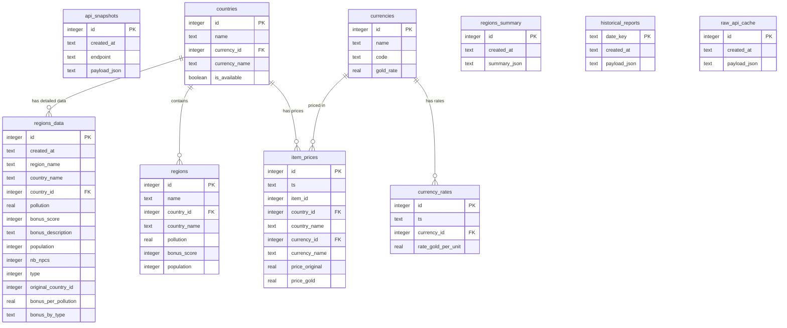

# 📊 Database Entity Relationship Diagram

## Visual Schema Overview

## 🔗 Key Relationships

### **Primary Relationships:**
- `countries` ↔ `currencies` (1:1) - Each country has one currency
- `countries` → `regions` (1:N) - Countries contain multiple regions  
- `countries` → `item_prices` (1:N) - Countries have item prices
- `currencies` → `currency_rates` (1:N) - Currencies have historical rates

### **Data Flow:**
1. **Countries & Currencies** → Static reference data
2. **API Snapshots** → Raw API responses (cache)
3. **Item Prices** → Economic data over time
4. **Currency Rates** → Exchange rates over time
5. **Regions** → Geographic/political data
6. **Reports** → Generated analysis results

## 📋 Table Categories

### **🏛️ Reference Data (Static)**
- `countries` - Country definitions
- `currencies` - Currency definitions  
- `regions` - Basic region info

### **📊 Time Series Data**
- `item_prices` - Economic prices over time
- `currency_rates` - Exchange rates over time
- `regions_data` - Detailed region data snapshots

### **💾 Cache & Storage**
- `api_snapshots` - Raw API response cache
- `raw_api_cache` - Latest complete data dump
- `historical_reports` - Generated report archive
- `regions_summary` - Processed region summaries

## 🎯 Usage Patterns

### **For Developers:**
- Start with `countries` and `currencies` for reference data
- Use `item_prices` and `currency_rates` for economic analysis
- Check `api_snapshots` for debugging API issues
- Store analysis results in `historical_reports`
